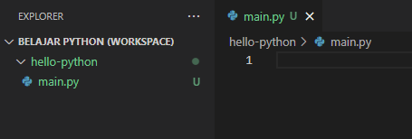
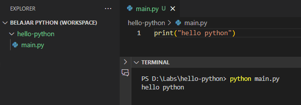

Bahasa pemrograman Python sangat sederhana dan mudah untuk dipelajari. Pada chapter ini kita akan langsung mempraktikannya dengan membuat program hello world.

## A.1.1. Program Hello Python

Siapkan sebuah folder dengan isi satu file program Python bernama `main.py`.



Pada file `main.py`, tuliskan kode berikut:

```python
print("hello python")
```

Run program menggunakan command berikut:

```bash
# python <nama_file_program>
python main.py
```



Selamat, secara official sekarang anda adalah programmer Python! 🎉 Mudah bukan!?

## A.1.2. Penjelasan program

Folder `hello-python` bisa disebut dengan folder *project*, dimana isinya adalah file-file program Python berekstensi `.py`.

File `main.py` adalah file program python. Nama file program bisa apa saja, tapi umumnya pada pemrograman Python, file program utama bernama `main.py`.

Command `python <nama_file_program>` digunakan untuk menjalankan program. Cukup ganti `<nama_file_program>` dengan nama file program (yang pada contoh ini adalah `main.py`) maka kode program di dalam file tersebut akan di-run oleh Python interpreter.

Statement `print("<pesan_text>")` adalah penerapan dari salah satu fungsi *built-in* yang ada dalam Python stdlib (standard library), yaitu fungsi bernama `print()` yang kegunaannya adalah untuk menampilkan pesan string (yang disipkan di argument fungsi) ke layar output atau stdout (yang pada contoh ini adalah terminal milik editor penulis).

> Lebih detailnya mengenai Python standard library (stdlib) dibahas terpisah pada chapter [Python standard library (stdlib)](#)

---

## Catatan chapter 📑

### ◉ Source code praktik

<pre>
    <a href="https://github.com/novalagung/dasarpemrogramanpython-example/tree/master/hello-python">
        github.com/novalagung/dasarpemrogramanpython-example/../hello-python
    </a>
</pre>

### ◉ Referensi

- https://www.learnpython.org/en/Hello,_World!
- https://docs.python.org/3/library/functions.html
